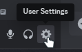
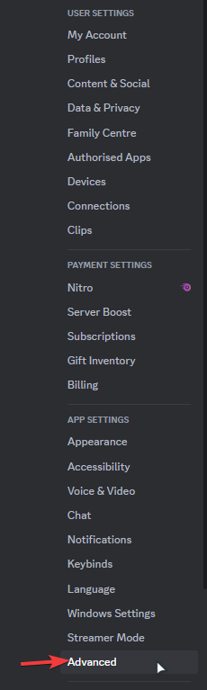
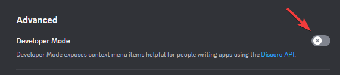

# Discord Message Deleter

[](https://www.rust-lang.org/)
[](https://opensource.org/licenses/MIT)
[](https://discord.com/developers/docs/intro)

A Rust tool to safely delete Discord messages in bulk, supporting both DMs and server channels.

[🇹🇷 Türkçe açıklama için tıklayın](#-türkçe-açıklama)

> [!WARNING]  
> Using user tokens might be against Discord's Terms of Service. Use at your own risk.

## ✨ Features

- 🚀 Bulk message deletion with configurable delays
- 💬 Support for both DM and server channels
- 🛡️ Rate limit handling
- 📊 Progress tracking and statistics
- ⚡ Skips system messages automatically
- 🕒 Handles messages older than 14 days
- ⚙️ Configurable deletion delays

## 📋 Prerequisites

- 🦀 Rust (latest stable version)
- 🔑 Discord User Token
- 👤 Discord User ID
- 📝 Channel/DM ID

## 🔑 Getting Required Information

### 1. Enable Developer Mode
1. Open Discord Settings
2. Go to App Settings > Advanced
3. Enable Developer Mode





### 2. Get Your User Token
> [!CAUTION]  
> Never share your token with anyone! It gives full access to your account.

1. Open Discord in your web browser (discord.com)
2. Press F12 to open Developer Tools
3. Go to the Network tab
4. Click on any channel or perform any action
5. Look for a request to discord.com/api
6. Find the "authorization" header in the request headers
7. The value of this header is your user token

### 3. Get Your User ID
1. With Developer Mode enabled, right-click on your name anywhere in Discord
2. Click "Copy ID"
3. This is your User ID that you'll use as AUTHOR_ID

### 4. Get Channel/DM ID
1. For servers: Right-click on the channel name and click "Copy ID"
2. For DMs: Right-click on the DM chat and click "Copy Channel ID" (not "Copy ID")
3. This is your Channel ID that you'll use when running the program

## 🚀 Setup

1. Clone the repository:
```bash
git clone https://github.com/i358/discordMessageDeleter
cd discordMessageDeleter
```

2. Copy the example environment file:
```bash
cp .example.env .env
```

3. Edit `.env` file with your credentials:
```env
DISCORD_TOKEN=your_discord_token_here
AUTHOR_ID=your_user_id_here
```

> [!IMPORTANT]  
> Make sure your `.env` file contains valid credentials:
> - DISCORD_TOKEN should be your user token (starts with a specific format)
> - AUTHOR_ID should be your user ID (17-20 digit number)
> - Both fields are required and must be valid for the program to work

4. Build the project:
```bash
cargo build --release
```

## 📖 Usage

1. Run the program:
```bash
cargo run --release
```

2. Enter the requested information:
   - 📝 Channel ID: The ID of the channel/DM where you want to delete messages
   - ⏱️ Delete Delay: Time to wait between message deletions (in milliseconds)
   - ⌛ Rate Limit Delay: Time to wait when hitting rate limits (in seconds)

3. Confirm the settings and let it run.

## ⚙️ Configuration

> [!NOTE]  
> - **Delete Delay**: Default is 50ms. Lower values might trigger rate limits more frequently.
> - **Rate Limit Delay**: Default is 5 seconds. Increase if you're getting too many rate limits.

## 🛡️ Safety Features

- ✅ Confirmation prompt before starting
- 🔍 Input validation for all parameters
- 🚦 Rate limit handling
- 📊 Progress tracking
- ⚠️ Error handling and reporting

## ❗ Important Notes

> [!IMPORTANT]  
> 1. This tool is for educational purposes only
> 2. The tool can only delete messages sent by the account owner
> 3. System messages cannot be deleted
> 4. Messages older than 14 days will be deleted one by one

> [!CAUTION]  
> Make sure you have proper permissions and understand the implications before using this tool.

## 🔒 Güvenlik

> [!TIP]  
> - Discord tokeninizi asla paylaşmayın
> - .env dosyanızı güvende tutun
> - Hassas bilgileri git'e commit etmeyin

## 🚀 Performans

> [!NOTE]  
> - Gecikmeleri ihtiyacınıza göre ayarlayın
> - Varsayılan silme gecikmesi: 50ms
> - Varsayılan rate limit gecikmesi: 5 saniye
> - Yüksek gecikmeler = Daha kararlı ama yavaş
> - Düşük gecikmeler = Daha hızlı ama rate limit riski yüksek

## 📄 Lisans

MIT Lisansı - Detaylar için [LICENSE](LICENSE) dosyasına bakın.

## 🤝 Katkıda Bulunma

Pull request'ler açığız. Büyük değişiklikler için lütfen önce bir issue açarak değişikliği tartışmaya açın.

## 📬 İletişim

Soru veya önerileriniz için:
1. Issue açın
2. Pull request gönderin
3. Projeyi forklayın

---

# Discord Mesaj Silme Aracı

[](https://www.rust-lang.org/)
[](https://opensource.org/licenses/MIT)
[](https://discord.com/developers/docs/intro)

Discord mesajlarını toplu olarak silmek için geliştirilmiş bir Rust aracı. Hem DM'lerde hem de sunucu kanallarında çalışır.

> [!WARNING]  
> Kullanıcı tokenlarını kullanmak Discord Kullanım Şartları'na aykırı olabilir. Riski size aittir.

## ✨ Özellikler

- 🚀 Ayarlanabilir gecikmelerle toplu mesaj silme
- 💬 DM ve sunucu kanalları desteği
- 🛡️ Rate limit koruması
- 📊 İlerleme takibi ve istatistikler
- ⚡ Sistem mesajlarını otomatik atlama
- 🕒 14 günden eski mesajları tek tek silme
- ⚙️ Özelleştirilebilir silme gecikmeleri

## 📋 Gereksinimler

- 🦀 Rust (en son kararlı sürüm)
- 🔑 Discord Kullanıcı Tokeni
- 👤 Discord Kullanıcı ID'si
- 📝 Kanal/DM ID'si

## 🔑 Gerekli Bilgileri Alma

### 1. Geliştirici Modunu Aktifleştirme
1. Discord Ayarlarını açın
2. Uygulama Ayarları > Gelişmiş'e gidin
3. Geliştirici Modu'nu aktifleştirin


### 2. Kullanıcı Token'ınızı Alma
> [!CAUTION]  
> Token'ınızı asla kimseyle paylaşmayın! Hesabınıza tam erişim sağlar.

1. Discord'u web tarayıcınızda açın (discord.com)
2. F12 tuşuna basarak Geliştirici Araçları'nı açın
3. Network (Ağ) sekmesine gidin
4. Herhangi bir kanala tıklayın veya bir işlem yapın
5. discord.com/api ile başlayan bir istek bulun
6. İstek başlıklarında "authorization" başlığını bulun
7. Bu başlığın değeri sizin kullanıcı token'ınızdır

### 3. Kullanıcı ID'nizi Alma
1. Geliştirici Modu aktifken, Discord'da herhangi bir yerde adınıza sağ tıklayın
2. "ID'yi Kopyala"ya tıklayın
3. Bu, AUTHOR_ID olarak kullanacağınız Kullanıcı ID'nizdir

### 4. Kanal/DM ID'si Alma
1. Sunucular için: Kanal adına sağ tıklayın ve "ID'yi Kopyala"ya tıklayın
2. DM'ler için: DM sohbetine sağ tıklayın ve "Kanal ID'sini Kopyala"ya tıklayın ("ID'yi Kopyala" değil)
3. Bu, programı çalıştırırken kullanacağınız Kanal ID'sidir

## 🚀 Kurulum

1. Repoyu klonlayın:
```bash
git clone https://github.com/i358/discordMessageDeleter
cd discordMessageDeleter
```

2. Örnek env dosyasını kopyalayın:
```bash
cp .example.env .env
```

3. `.env` dosyasını bilgilerinizle düzenleyin:
```env
DISCORD_TOKEN=discord_tokeniniz
AUTHOR_ID=kullanici_id_niz
```

> [!IMPORTANT]  
> `.env` dosyanızın geçerli bilgiler içerdiğinden emin olun:
> - DISCORD_TOKEN kullanıcı tokeniniz olmalı (belirli bir formatla başlar)
> - AUTHOR_ID kullanıcı ID'niz olmalı (17-20 haneli sayı)
> - Her iki alan da gereklidir ve programın çalışması için geçerli olmalıdır

4. Projeyi derleyin:
```bash
cargo build --release
```

## 📖 Kullanım

1. Programı çalıştırın:
```bash
cargo run --release
```

2. İstenen bilgileri girin:
   - 📝 Kanal ID: Mesajları silmek istediğiniz kanal/DM'in ID'si
   - ⏱️ Silme Gecikmesi: Her mesaj silme işlemi arasında beklenecek süre (milisaniye)
   - ⌛ Rate Limit Gecikmesi: Rate limit yediğinde beklenecek süre (saniye)

## ⚙️ Yapılandırma

> [!NOTE]  
> - **Silme Gecikmesi**: Default is 50ms. Lower values might trigger rate limits more frequently.
> - **Rate Limit Gecikmesi**: Default is 5 seconds. Increase if you're getting too many rate limits.

## 🛡️ Güvenlik Özellikleri

- ✅ Başlamadan önce onay isteme
- 🔍 Tüm parametreler için giriş doğrulama
- 🚦 Rate limit koruması
- 📊 İlerleme takibi
- ⚠️ Hata yakalama ve raporlama

## ❗ Önemli Notlar

> [!IMPORTANT]  
> 1. Bu araç eğitim amaçlıdır
> 2. Sadece hesap sahibinin mesajlarını silebilir
> 3. Sistem mesajları silinemez
> 4. 14 günden eski mesajlar tek tek silinir

> [!CAUTION]  
> Kullanmadan önce gerekli izinlere sahip olduğunuzdan ve sonuçlarını anladığınızdan emin olun.

## 🔒 Güvenlik

> [!TIP]  
> - Discord tokeninizi asla paylaşmayın
> - .env dosyanızı güvende tutun
> - Hassas bilgileri git'e commit etmeyin

## 🚀 Performans

> [!NOTE]  
> - Gecikmeleri ihtiyacınıza göre ayarlayın
> - Varsayılan silme gecikmesi: 50ms
> - Varsayılan rate limit gecikmesi: 5 saniye
> - Yüksek gecikmeler = Daha kararlı ama yavaş
> - Düşük gecikmeler = Daha hızlı ama rate limit riski yüksek

## 📄 Lisans

MIT Lisansı - Detaylar için [LICENSE](LICENSE) dosyasına bakın.

## 🤝 Katkıda Bulunma

Pull request'ler açığız. Büyük değişiklikler için lütfen önce bir issue açarak değişikliği tartışmaya açın.

## 📬 İletişim

Soru veya önerileriniz için:
1. Issue açın
2. Pull request gönderin
3. Projeyi forklayın 

---

<div align="center">
Made with ❤️ by <a href="https://github.com/i358">i358</a>
</div>
